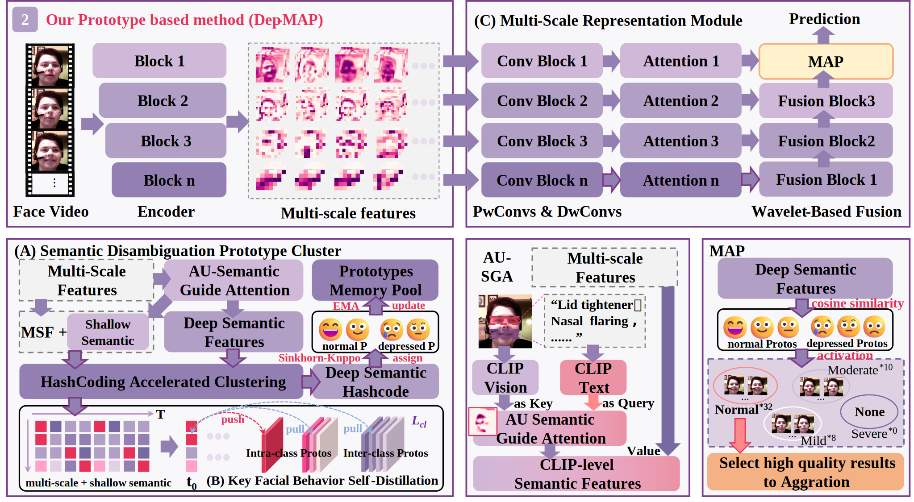

# Background & Challenge: 
Analyzing how facial expressions change over time is an important way to assess the mental state of depressed patients. However, in real life, many patients try to hide their symptoms and may look similar to healthy people, and those with different levels of severity can also show different facial behaviors, which makes depression assessment more difficult.
# Dep-MAP
We propose Dep-MAP, which has three main modules: 

(1)SDPM clusters deep emotion features into sparse, clear prototypes. 

(2)KBM aligns the semantics of shallow and deep features. 

(3)MSR fuses multi-scale spatiotemporal features to give a video-level depression score.

First, Dep-MAP uses a semantic prototype clustering module to group facial features into clearly different pattern types, so it can describe how facial behavior changes with different levels of depression.
Then, it adds a cross-scale semantic alignment loss that makes features from the same group closer and better controlled by semantics, which helps the Dep-MAP to detect very subtle facial changes in patients.
# Contributions: 
Experiments show that Dep-MAP can effectively detect important facial behaviors that are hidden in the video context. By grouping and combining key frames with similar meaning, it achieves clearly better, state-of-the-art performance on the public AVEC2013 and AVEC2014 datasets.
# Run
Open the folder and run 'python main.py'.

Required environment: Python 3.8 or higher.
# Structure of Dep-MAP

